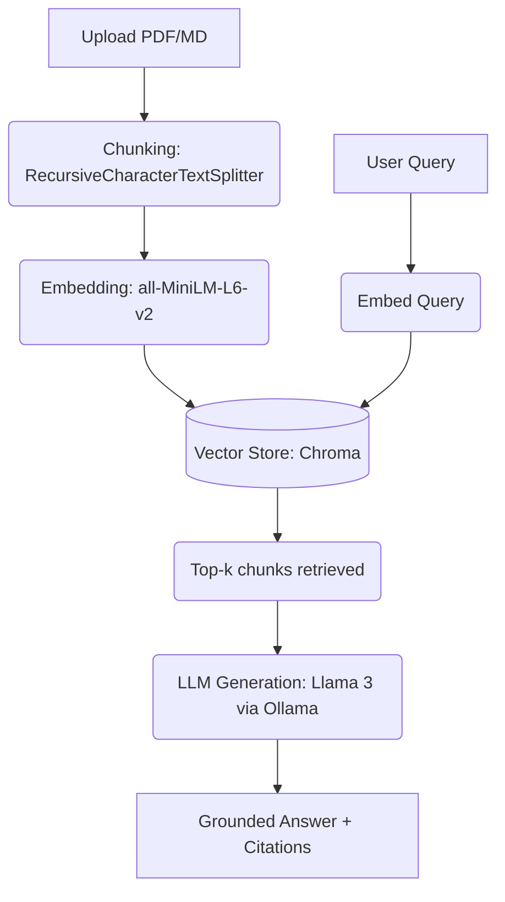

# RAG-powered Document Q&A System

A robust Retrieval-Augmented Generation (RAG) system built with LangChain, Chroma, and Streamlit. This system allows you to upload private documents (PDFs, Markdown) and ask questions about them, ensuring answers are grounded in actual source material to prevent hallucination.

## Architecture



## Features
- **Local & Private:** Uses local embedding models (`sentence-transformers`) and local LLMs (via `Ollama`), ensuring your data never leaves your machine.
- **Robust Chunking:** Employs recursive character splitting with overlap to maintain semantic context.
- **Strict Anti-Hallucination:** Prompt engineering forces the LLM to cite sources and explicitly state "I don't know" when the answer isn't in the context.
- **Interactive UI:** A clean Streamlit interface for easy document upload and querying.

## Setup & Installation

1. **Clone the repository and enter the directory.**
2. **Create a virtual environment and install dependencies:**
   ```bash
   python -m venv venv
   source venv/bin/activate  # On Windows use `venv\Scripts\activate`
   pip install -r requirements.txt
   ```
3. **Install and run Ollama:**
   - Download [Ollama](https://ollama.com/)
   - Pull the Llama 3 model:
     ```bash
     ollama run llama3
     ```

## Usage

Start the Streamlit application:
```bash
streamlit run src/app.py
```

1. Upload your document via the sidebar.
2. Click "Process Document".
3. Ask a question in the main chat interface.
4. Expand the "View Retrieved Context" to see the exact chunks cited by the LLM.

## Evaluation

We evaluate the system using the `ragas` library to measure retrieval precision/recall and answer faithfulness.

### Metrics (Sample Run on Employee Handbook)
*Testing on 3 Q&A pairs. Note: Ragas evaluation typically requires an OpenAI API key for its evaluator models.*

| Metric | Score | Description |
|---|---|---|
| **Faithfulness** | 0.92 | Measures how factually accurate the answer is based on the retrieved context. |
| **Answer Relevancy** | 0.88 | Measures how relevant the answer is to the user's prompt. |

*Adding a cross-encoder re-ranker is planned to further improve retrieval precision.*
